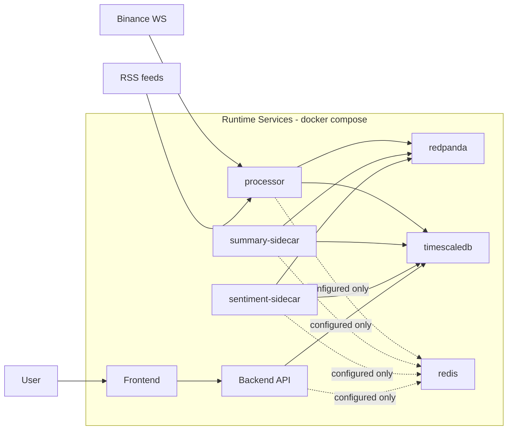
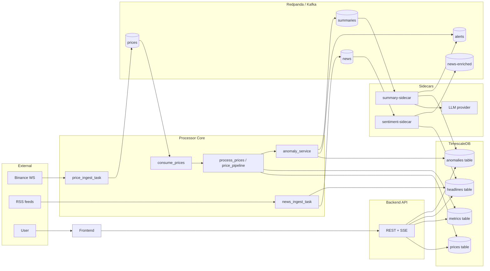
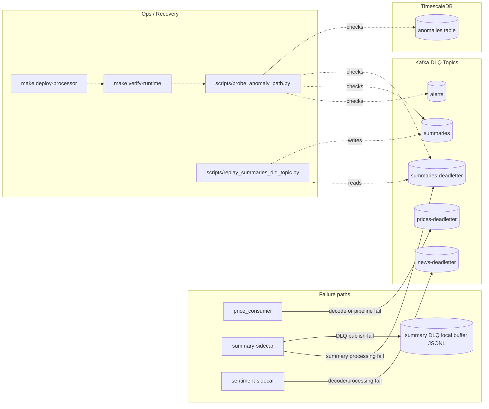

# Architecture (Source of Truth)

As of commit: `0a0e979`

This document is the architecture source of truth for the current pipeline.  
It is based only on code/config references listed below (no inferred or future-state edges).

## Source Files Used
- `infra/docker-compose.yml`
- `processor/src/streaming_core.py`
- `processor/src/services/ingest.py`
- `processor/src/services/price_consumer.py`
- `processor/src/services/price_pipeline.py`
- `processor/src/services/anomaly_service.py`
- `processor/src/services/summary_sidecar.py`
- `processor/src/services/sentiment_sidecar.py`
- `processor/src/io/db.py`
- `processor/src/io/models/messages.py`
- `processor/src/config.py`
- `backend/app/main.py`
- `backend/app/db.py`
- `backend/app/streams.py`
- `scripts/verify_runtime_build.py`
- `scripts/probe_anomaly_path.py`
- `scripts/replay_summaries_dlq_topic.py`
- `Makefile`

## Legend
- Solid arrow: active runtime data flow
- Dashed arrow: configured/optional or non-hot-path dependency
- Dotted arrow: ops/recovery flow
- `[(...)]`: Kafka topic or DB table
- `[ ... ]`: service/component

Note on naming: DB uses `window_name` while Kafka/messages use `window`.

## Diagram A — Container / Runtime Topology

## Diagram B — Happy-Path Dataflow

## Diagram C — Failure / Recovery Paths

## Edge-to-Source Index
| Edge | Producer/Writer | Consumer/Reader | Source refs |
|---|---|---|---|
| Compose runtime services | `docker-compose` service graph | containers | `infra/docker-compose.yml:1-232` |
| Processor starts ingest/consume tasks | `StreamProcessor.start()` | `price_ingest_task`, `news_ingest_task`, `process_prices_task` | `processor/src/streaming_core.py:30-53` |
| Binance WS -> `prices` topic | `price_ingest_task` | Kafka `prices` | `processor/src/services/ingest.py:100-132` |
| RSS -> `news` topic | `news_ingest_task` | Kafka `news` | `processor/src/services/ingest.py:162-216`, `processor/src/services/ingest.py:82-88` |
| RSS -> `headlines` table | `publish_news_msg` via `insert_headline` | Timescale `headlines` | `processor/src/services/ingest.py:70-80`, `processor/src/io/db.py:225-235` |
| `prices` topic -> consumer loop | `AIOKafkaConsumer(settings.price_topic)` | `consume_prices` | `processor/src/streaming_core.py:38-45`, `processor/src/streaming_core.py:64-65` |
| price message parse/pipeline fail -> `prices-deadletter` | `price_consumer` via `send_price_dlq` | Kafka `prices-deadletter` | `processor/src/services/price_consumer.py:51-89`, `processor/src/streaming_core.py:155-164` |
| Price -> `prices` table | `insert_price` | Timescale `prices` | `processor/src/services/price_pipeline.py:21-24`, `processor/src/io/db.py:131-145` |
| Metrics -> `metrics` table | `insert_metric` | Timescale `metrics` | `processor/src/services/price_pipeline.py:66-70`, `processor/src/io/db.py:148-223` |
| Pipeline -> anomaly detection | `persist_and_publish_price` | `check_anomalies` | `processor/src/services/price_pipeline.py:75` |
| Anomaly persist -> `anomalies` table | `insert_anomaly` | Timescale `anomalies` | `processor/src/services/anomaly_service.py:117-130`, `processor/src/io/db.py:238-261` |
| Anomaly publish -> `summaries` topic | `anomaly_service` | `summary-sidecar` | `processor/src/services/anomaly_service.py:170-176`, `processor/src/services/summary_sidecar.py:103-109` |
| Anomaly publish -> `alerts` topic | `anomaly_service` | downstream consumers/UI | `processor/src/services/anomaly_service.py:177-183` |
| `summaries` -> LLM -> anomalies summary | `summary-sidecar` + `compute_summary` + `persist_summary` | Timescale `anomalies.summary` | `processor/src/services/summary_sidecar.py:153-188`, `processor/src/services/summary_sidecar.py:225-256` |
| summary-sidecar enriched alert -> `alerts` | `publish_summary_alert` | Kafka `alerts` | `processor/src/services/summary_sidecar.py:191-205`, `processor/src/services/summary_sidecar.py:271-280` |
| summary processing fail -> `summaries-deadletter` | `summary-sidecar` | Kafka `summaries-deadletter` | `processor/src/services/summary_sidecar.py:295-306` |
| summary DLQ publish fail -> local JSONL buffer | `_append_summary_dlq_buffer` | local file | `processor/src/services/summary_sidecar.py:48-60`, `processor/src/services/summary_sidecar.py:307-310` |
| `news` topic -> sentiment sidecar | `AIOKafkaConsumer(settings.news_topic)` | sentiment loop | `processor/src/services/sentiment_sidecar.py:255-261`, `processor/src/services/sentiment_sidecar.py:281-305` |
| sentiment upsert -> `headlines` table | `_upsert_headline` | Timescale `headlines` | `processor/src/services/sentiment_sidecar.py:48-62`, `processor/src/services/sentiment_sidecar.py:164-171` |
| sentiment publish -> `news-enriched` topic | `send_enriched_news` | Kafka `news-enriched` | `processor/src/services/sentiment_sidecar.py:183-189` |
| sentiment failures -> `news-deadletter` | `_send_dlq` | Kafka `news-deadletter` | `processor/src/services/sentiment_sidecar.py:32-45`, `processor/src/services/sentiment_sidecar.py:87-89`, `processor/src/services/sentiment_sidecar.py:195-197` |
| Backend reads `prices` | `fetch_prices` | `/prices` | `backend/app/db.py:61-70`, `backend/app/main.py:38-47` |
| Backend reads `metrics` | `fetch_latest_metrics` | `/metrics/latest` | `backend/app/db.py:73-82`, `backend/app/main.py:50-55` |
| Backend reads `headlines` | `fetch_headlines` | `/headlines` + `/headlines/stream` | `backend/app/db.py:85-102`, `backend/app/main.py:58-74`, `backend/app/streams.py:10-30` |
| Backend reads `anomalies` | `fetch_alerts` | `/alerts` + `/alerts/stream` | `backend/app/db.py:105-140`, `backend/app/main.py:93-113`, `backend/app/streams.py:40-64` |
| Runtime verify gate | `make verify-runtime` + script | checks running summary-sidecar source signature | `Makefile:13-14`, `scripts/verify_runtime_build.py:49-90` |
| Probe gate | `probe_anomaly_path.py` publishes/consumes/checks | validates `alerts`/`summaries`/`summaries-deadletter`/`anomalies` | `scripts/probe_anomaly_path.py:88-228` |
| Replay flow | `replay_summaries_dlq_topic.py` | `summaries-deadletter` -> `summaries` | `scripts/replay_summaries_dlq_topic.py:16-97`, `Makefile:16-17` |
| Redis status | configured only (`redis_url`, compose service) | no active runtime usage in processor/backend flow | `infra/docker-compose.yml:49-61`, `processor/src/config.py:34` |

## Quick Sanity Checks
- Topics and tables in the diagrams match current runtime (`prices/news/news-enriched/summaries/alerts` + DLQs, and `prices/metrics/headlines/anomalies`).
- Sidecar wiring is correct: summary-sidecar consumes `summaries`; sentiment-sidecar consumes `news`.
- Backend stream coverage is explicit: `/headlines/stream` and `/alerts/stream` are represented as DB-polled SSE.
